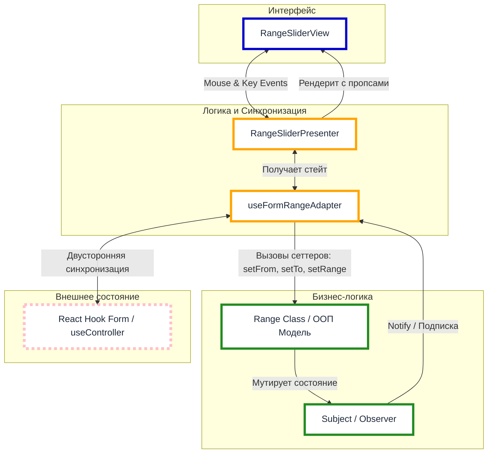
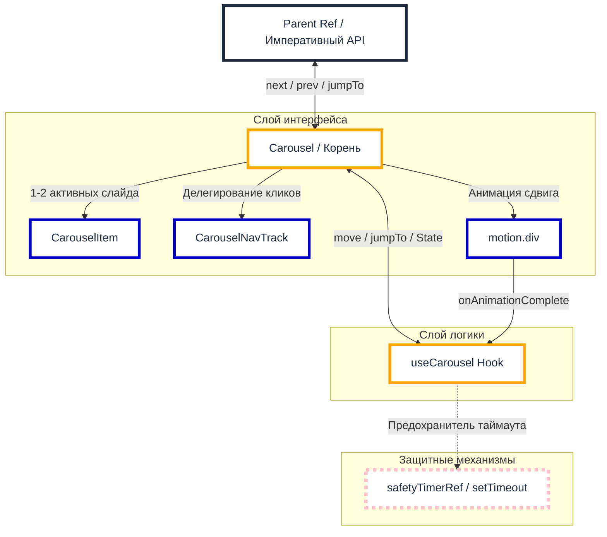
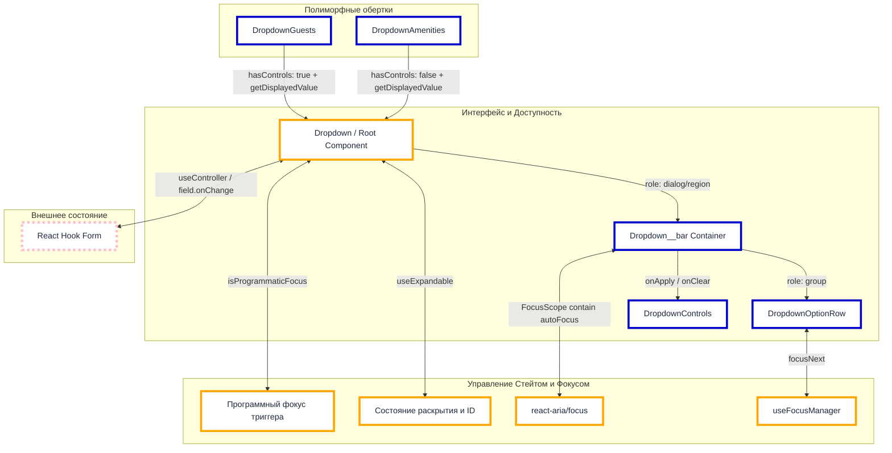
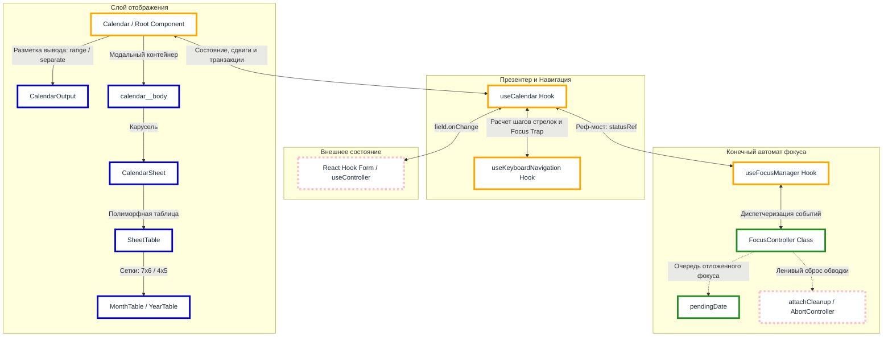

# Toxin Hotel Booking Platform (Frontend)

Фронтенд-приложение платформы бронирования отелей, разработанное на базе **React 19**, **TypeScript 6**, **Vite 8** и **Framer Motion**. В основе проекта лежит кастомный UI-Kit, реализованный без использования сторонних библиотек компонентов.

🌐 **[Демо-стенд приложения](https://toxin-site-frontend.onrender.com)**

---

## Инструкция по развертыванию

### Клонирование репозитория

```bash
git clone https://github.com/voxman90/toxin-site-frontend
cd toxin-site-frontend
```

### Установка зависимостей

```bash
npm install
```

## Скрипты

### Запуск в режиме локальной разработки

```bash
npm run dev
```

### Запуск линтера

```bash
npm run lint
```
С исправлением ошибок:
```bash
npm run lint:fix
```

### Запуск тестов (Vitest)
```bash
npm run test
```
В режиме наблюдения:
```bash
npm run test:watch
```

### Запуск форматирования (Prettier)

```bash
npm run format
```

---

## I. Подробное описание

### 1. Общий подход

Фронтенд базируется на стеке **TypeScript**, **React**, **Redux**, **SCSS** и **Vite**. Бэкенд использует **TypeScript**, **Express**, **Mongoose** и **MongoDB**. Репозитории для фронтенда и бэкенда полностью разделены.

Фронтенд структурно разделен на две части:
* **Страницы бизнес-логики** — лендинг, страницы регистрации и авторизации, продвинутый поиск и букинг.
* **Выделенная песочница** — изолированное окружение для ручного тестирования элементов интерфейса (цвета, шрифты, карточки, футеры, хедеры и компоненты форм).

### 2. Качество кода

Качество и стабильность кодовой базы обеспечиваются за счет комплексного подхода:
* Чистоту кода контролирует **ESLint** со строгими правилами линтинга.
* Стилистическое единообразие гарантирует **Prettier**.
* Предотвращение критических ошибок ложится на статическую типизацию **TypeScript** и схемы валидации (**Yup** на фронтенде, **Zod** на бэкенде).
* Надежность функционала проверяется через *unit* и *интеграционные тесты* в **Vitest**.
* Соблюдение контракта автоматизировано через спецификацию **OpenAPI** и пайплайны **GitHub Actions**.
* Для обнаружения сложноуловимых ошибок используется изолированная песочница с развернутым **UI-Kit**.

#### 1. Контракт

Контракт со стороны фронтенда первично валидируется через статическую типизацию **TypeScript**. Типы генерирует бэкенд и передает их через GitHub Action на фронтенд. 

Процесс генерации выглядит следующим образом:
1. Бэкенд создает контракт на основе *Zod-схем* и описания эндпоинтов с помощью пакета **@asteasolutions/zod-to-openapi**.
2. С помощью **openapi-typescript** генерируются типы на основе этого контракта.

На фронтенде типы извлекаются из сгенерированного файла `api.ts`. Они используются для типизации **Yup-схем**, путей, а также соответствующих сущностей (комнаты, пользователи, обзоры, правила, сервисы и т.д.).

#### 2. Тестирование

Для написания тестов используется **Vitest**. По умолчанию настроена среда **Node**, для тестирования с использованием `user-events` применяется **js-dom**, а для симуляции браузерного окружения — **happy-dom**. 

В процессе тестирования активно задействован стандартный арсенал для изоляции логики и ускорения асинхронных операций: моки, шпионы, стабы, подложные таймеры и т.д.

При тестировании компонентов, по возможности, используются методы объекта `screen` для дополнительной проверки **доступности**.

#### 3. Принципы

Принципы **DRY**, **SOLID** и **YAGNI** используются как ориентиры, а концепция **DAMP** — при написании тестов.

Главными критериями при проектировании кода являются:
* **Читаемость** (самодокументируемость).
* **Изоляция логики** (возведение барьеров абстракции, MVP, применение паттернов).
* **Тестируемость** (чистота функций, иммутабельность, идемпотентность).

Глобальный стейт вынесен в слайсы **Redux Toolkit**, а сетевые запросы — в асинхронные экшены (**thunks**). Для хранения и устойчивости query-запросов URL используется как **SSOT** (единый источник правды). 

Для разгрузки компонентов и вынесения переиспользуемой логики применяются **кастомные хуки**. Стилизация реализуется через возможности современных CSS-переменных, каскадных слоев, нестинга, а также функций и миксинов **SCSS**.

#### 4. Безопасность

Реализована **сквозная валидация**: на фронтенде формы проверяются через схемы **Yup**, а на бэкенде входящие запросы фильтруются с помощью **Zod**. Перед обработкой бизнес-логикой все *query-параметры* проходят через кастомный парсер, который приводит строки к примитивам, исключая аномалии типов.

Аутентификация построена на **JWT**, который хранится в `localStorage` и подмешивается к запросам через интерцептор **Axios**. Пароли хэшируются через **bcryptjs** перед записью в базу данных.

Сетевой слой **бэкенда** защищен:
* Базовыми заголовками **helmet**.
* Мидлварой **express-rate-limit** для ограничения частоты запросов.
* Настроенным **CORS** (с ограничением по методам и списком разрешенных доменов из переменных окружения).

#### 5. Доступность

Интерфейс опирается на **семантические теги** и полностью управляется с клавиатуры. Кастомные компоненты (такие как дропдауны, календарь, *range*-слайдер, карусель, пагинация и т.д.) снабжены необходимыми **aria-атрибутами**.

Для контроля фокуса используется библиотека **@react-aria**. С ее помощью реализованы, например, ловушки фокуса (**focus trap**) и кастомное поведение фокуса для дропдауна с реактивным/транзитивным стейтом.

Нативное поведение фокуса остается предпочтительным во избежание потенциального рассинхрона с состоянием React. Однако пока в спецификацию не добавлен флаг для программного `focus-visible`, приходится использовать обходные пути.

#### 6. Обработка ошибок

Страницы обернуты в **ErrorBoundary** для предотвращения падения всего приложения.

Часть ошибок локализуется внутри страниц. В зависимости от характера ошибки выводится соответствующая заглушка или диалоговое окно (например, с информацией об ошибке и кнопками «Вернуться на главную» или «Повторить запрос»).

На уровне форм ошибки отлавливаются с помощью схем валидации **yup**. Эти же схемы используются для предотвращения запросов к бэкенду с невалидными данными (например, когда параметры берутся напрямую из URL-адреса).

Некоторые типы ошибок — например, неудача при попытке поставить лайк посту — выводятся с помощью всплывающих уведомлений (**react-toastify**).

#### 7. Стили

Стили написаны с ориентацией на методологию **БЭМ** и реализованы преимущественно через возможности современного CSS. Для управления специфичностью и разделения глобального контекста используются **каскадные слои** (`@layer`: `reset`, `utilities`). Основная часть переиспользуемых величин вынесена в **CSS-переменные**.

Адаптивность интерфейса обеспечивается за счет:
* Использования брейкпоинтов и медиа-запросов (`@media`).
* Применения функции `clamp()`, относительных единиц.
* Актуальных способов центрирования и организации раскладки (`grid`, `flex`, `flow-root` и т.д.).

**SCSS** используется исключительно как надстройка для задач, которые не решаются нативным CSS (или если соответствующие методы еще широко не поддерживаются браузерами). Например:
* **Миксины** — для типографики и динамической подстановки шрифтов.
* **Плейсхолдеры** (`%shimmer`, `%disabled`) — для переиспользования анимаций и состояний интерфейса.

#### 8. Интернационализация

Представлены две локали — русская и английская. Реализована интернационализация на базе **i18next** с разделением переводов по пространствам имен (`components`, `pages`, `ui-kit`). Она затрагивает как тексты компонентов, так и содержимое *aria-атрибутов*, а также статические и динамические строки — через встроенную **плюрализацию** и **интерполяцию** i18next.

Переводы **строго типизированы**, что исключает использование невалидных ключей еще на этапе компиляции.

Вывод относительного времени динамически форматируется через библиотеку **date-fns**.

#### 9. Оптимизация

Никакой преждевременной оптимизации. В остальном — **мемоизация** для React-компонентов (`memo`, `useMemo`, `useCallback`, стабильные ссылки, инкапсуляция логики в подкомпоненты, уплощение объектов в списке зависимостей), сознательное невмешательство в работу JIT-компилятора, чанкование, ленивая загрузка и т.д.

Также применяется:
* Использование более легких и быстрых альтернатив (happy-dom вместо js-dom, clsx вместо classnames, tsx вместо ts-node и т.д.).
* Избирательные импорты для эффективного **tree shaking**.
* Борьба с утечками памяти через **abort-контроллеры**, удаление «мертвых» слушателей событий и т.д.

#### 10. UX

Для исключения визуального шума и мигания элементов во время загрузки данных сетка страниц замещается **компонентами-скелетонами**. Для отдельных запросов добавлена минимальная задержка при ответе (на стороне фронтенда) для предотвращения мигания лоадеров. Даже если данные не изменились, через *скелетоны* или *блюр* (в зависимости от того, есть ли отображаемые элементы до запроса) визуализируется процесс загрузки, чтобы пользователь понимал — форма сработала.

Интенсивный ввод пользователя защищен **дебаунсом** (работающим для конкретных полей, например, ползунка цен, в том числе при взаимодействии с клавиатурой). Повторные нажатия чекбоксов не приводят к мерцанию карточек, так как промежуточные запросы **абортируются**. Формы подсвечивают невалидные поля, выводят информацию об ошибках и переводят на них фокус.

Параметры интерфейса на странице поиска и букинга (фильтры, пагинация) **синхронизированы с URL-адресом**. Это позволяет пользователю бесшовно использовать навигацию «Назад/Вперед» в браузере, обновлять страницу и делиться ссылкой.

## 3. Ключевые компоненты

### 1 Range-slider

#### Описание

Рендж-слайдер с двумя ползунками для задания диапазона значений. Реализован в соответствии с паттерном MVP (Model-View-Presenter): бизнес-логика и математика расчетов инкапсулированы в изолированном классе, а синхронизация с состоянием форм React выполняется через кастомный хук-адаптер.

#### Схема



#### Пропсы

| Свойство | Тип | Обязательный | По умолчанию | Описание |
| :--- | :--- | :---: | :---: | :--- |
| `nameFrom` | `Path<T>` | **Да** | — | Имя поля формы для нижнего значения интервала (`from`). |
| `nameTo` | `Path<T>` | **Да** | — | Имя поля формы для верхнего значения интервала (`to`). |
| `control` | `Control<T>` | **Да** | — | Объект `control` из инстанса `react-hook-form`. |
| `config` | `Partial<RangeState>` | Нет | — | Конфигурация для инициализации модели. |
| `orientation` | `'horizontal' \| 'vertical'` | Нет | `'horizontal'` | Визуальная ориентация слайдера. |
| `isRangeDraggable`| `boolean` | Нет | `false` | Разрешает перетаскивание интервала за трек. |
| `disabled` | `boolean` | Нет | `false` | Блокирует события мыши и навигацию с клавиатуры. |
| `onMouseDown` | `(end: Ends \| 'range') => void` | Нет | — | Колбэк при нажатии мыши на ползунок или трек. |
| `onKeyDown` | `(e: KeyEvent, end: Ends \| 'range') => void` | Нет | — | Колбэк при нажатии клавиши на активном элементе. |
| `onKeyUp` | `(e: KeyEvent, end: Ends \| 'range') => void` | Нет | — | Колбэк при отпускании клавиши на активном элементе. |

### 2 Карусель

#### Описание

Компонент реализует циклическую карусель на базе анимаций framer-motion, с возможностью императивного контроля.

Рендеринг: Компонент не рендерит все слайды одновременно. На основе флагов состояния в DOM монтируются строго 1, либо 2 элемента (текущий статичный слайд, уходящий slidingFrom и приходящий slidingTo).

Логика состояний: Кастомный хук инкапсулирует стейт-машину сдвигов. Завершение анимации финализируется на уровне микротасок. Случай зависания анимации обрабатывается с помощью таймера (safetyTimerRef), принудительно завершающего фазу анимации по истечении таймаута.

Циклический расчет: Математический хелпер рассчитывает кратчайшую траекторию движения при прыжках через несколько слайдов на основе остатка от деления.

Динамический трек навигации: Реализует паттерн скользящего окна. Если количество слайдов превышает 5, трек смещается по горизонтали, а крайние видимые точки сжимаются в размерах, визуально имитируя бесконечную ленту. Для оптимизации кликов используется делегирование событий на общем контейнере трека.

#### Схема



#### Пропсы

| Свойство | Тип | Обязательный | По умолчанию | Описание |
| :--- | :--- | :---: | :---: | :--- |
| `children` | `CarouselChildren` | **Да** | — | Дети, строго `CarouselItem`. |
| `activeItemIndex`| `number` | Нет | `0` | Индекс активного слайда при инициализации. |
| `hasControlButtons`| `boolean` | Нет | `false` | Флаг отображения боковых кнопок Prev/Next. |
| `hasNavPanel` | `boolean` | Нет | `false` | Флаг отображения навигационной панели. |
| `isFocusable` | `boolean` | Нет | `false` | Включает фокус на боковых кнопках. |
| `transition` | `Transition` | Нет | `duration: 0.4` | Конфигурация кривой и длительности анимации для `framer-motion`. |
| `onAnimationEnd` | `(index: number) => void` | Нет | `NOOP` | Колбэк, вызываемый по завершении сдвига слайдов. |

#### Императивный интерфейс

Передаётся через ref родительскому компоненту:

| Метод | Сигнатура | Описание |
| :--- | :--- | :--- |
| `next` | `() => void` | Переключить на следующий слайд. |
| `prev` | `() => void` | Переключить на предыдущий слайд. |
| `jumpTo` | `(to: number) => void` | Перейти на указанный слайд. |
| `getElement` | `() => HTMLDivElement \| null` | Возвращает ссылку на корневой DOM-контейнер карусели. |

### 3. Дропдаун

#### Описание

Компонент с выпадающим окном для выбора количественных параметров. Работает в режиме транзакционного (с контрольной панелью), либо реактивного состояния. Расширяется обертками (DropdownGuests, DropdownAmenities) через передачу конфигурации и колбэка getDisplayedValue, возвращающего отображаемое значение в триггере.

Транзакционное\реактивное состояние: Поведение компонента регулируется флагом hasControls. При его активации изменения временно изолируются в локальном черновике. Клик на кнопку "Применить" синхронизирует черновик с react-hook-form. Кнопка "Очистить" сбрасывает данные кально.

При отсутствии контрольной панели значения обновляются реактивно, при каждом нажатии на кнопки опций.

Управление фокусом: Для интеграции с RHF передаёт через ref focusApi. Для программного фокуса обеспечивается обводка. В транзакционном режиме включает ловушку фокуса для модального окна, а для реактивного - обеспечивает его скрытие при табуляции вне.

Чтобы фокус не застревал при деактивации кнопок опций (например, при достижении максимума диапазона), фокус принудительно переносится на соседний интерактивный элемент.

#### Схема



#### Пропсы

| Свойство | Тип | Обязательный | По умолчанию | Описание |
| :--- | :--- | :---: | :---: | :--- |
| `name` | `Path<T>` | **Да** | — | Имя поля формы для объекта опций. |
| `control` | `Control<T>` | **Да** | — | Объект `control` из инстанса `react-hook-form`. |
| `options` | `DropdownOption[]` | **Да** | — | Массив конфигураций опций (имя, описание, диапазон min/max). |
| `getDisplayedValue`| `(state: DropdownValues) => string` | **Да** | — | Функция для вычисления и локализации итоговой строки триггера. |
| `labelText` | `string` | Нет | `''` | Текст заголовка компонента. |
| `labelAppendix` | `string` | Нет | `''` | Дополнительный текст (аппендикс) заголовка (отображается справа от основного текста). |
| `isExpanded` | `boolean` | Нет | `false` | Начальное состояние раскрытия списка при монтировании. |
| `isExpandingDisabled`| `boolean` | Нет | `false` | Флаг блокирующий раскрытие\скрытие выпадающего списка. |
| `hasControls` | `boolean` | Нет | `false` | Включает режим черновика (транзакционного стейта) и рендерит кнопки Применить/Очистить. |
| `size` | `'md' \| 'lg'` | Нет | `'lg'` | Управляет фиксированной шириной компонента. |
| `ref` | `RefObject<DropdownRef \| null>` | Нет | — | Реф для императивного вызова метода `focus()` (например, при ошибках валидации). |

### 4. Календарь

#### Описание

Календарь с бесконечной горизонтальной прокруткой листов, зумом (переключения режима месяц/год) и строгим управлением клавиатурным фокусом.

Управление состоянием: До момента нажатия кнопки "Применить" выбранные даты изолируются в буфере trace, не затрагивая форму. При закрытии календаря состояние синхронизируется обратно. Через useEffect развернут таймер-планировщик, который каждую полночь автоматически обновляет today и аннулирует просроченные даты прямо в открытом интерфейсе.

Смена листов и режима месяц\год: Календарь поддерживает два формата отображения: месяц и год. Переключение между ними (зум) анимировано через framer-motion. Смена листов календаря осуществляется через компонент Carousel.

Работа с фокусом: Фокус управляется через класс-контроллер, представляющий из себя конечный автомат с императивным управлением. Он синхронизирует фокус в DOM со стейтом через реф-геттер () => statusRef.current, исключая лишние ререндеры. Контроллер обрабатывает очередь отложенного фокуса для асинхронных анимаций карусели, возвращает фокус на триггер и т.д.

Навигация по ячейкам календаря осуществляется с помощью паттерна roving index. Фокус удерживается в модальном окне (focus trap).

#### Схема



#### Пропсы

| Свойство | Тип | Обязательный | По умолчанию | Описание |
| :--- | :--- | :---: | :---: | :--- |
| `nameFrom` | `Path<T>` | **Да** | — | Имя поля формы для даты прибытия (`from`). |
| `nameTo` | `Path<T>` | **Да** | — | Имя поля формы для даты отбытия (`to`). |
| `control` | `Control<T>` | **Да** | — | Объект `control` из инстанса `react-hook-form`. |
| `outputFormat` | `'range' \| 'separate' \| 'hidden'` | **Да** | — | Формат рендеринга инпутов шапки. |
| `sheetFormat` | `'month' \| 'year'` | Нет | `'month'` | Режим сетки при открытии. |
| `isExpanded` | `boolean` | Нет | `false` | Начальное состояние раскрытия календаря при монтировании. |
| `label` | `string` | Нет* | `''` | Заголовок поля. Обязателен только при `outputFormat: 'range'`. |
| `labelFrom` | `string` | Нет* | `''` | Заголовок даты заезда. Обязателен только при `outputFormat: 'separate'`. |
| `labelTo` | `string` | Нет* | `''` | Заголовок даты выезда. Обязателен только при `outputFormat: 'separate'`. |
| `ref` | `RefObject<CalendarRef \| null>` | Нет | — | Внешний императивный реф для фокуса полей. |

#### Императивный интерфейс

| Путь метода | Сигнатура | Описание |
| :--- | :--- | :--- |
| `from.focus` | `() => void` | Программный фокус инпута прибытия. |
| `to.focus` | `() => void` | Программный фокус инпута отбытия. |
