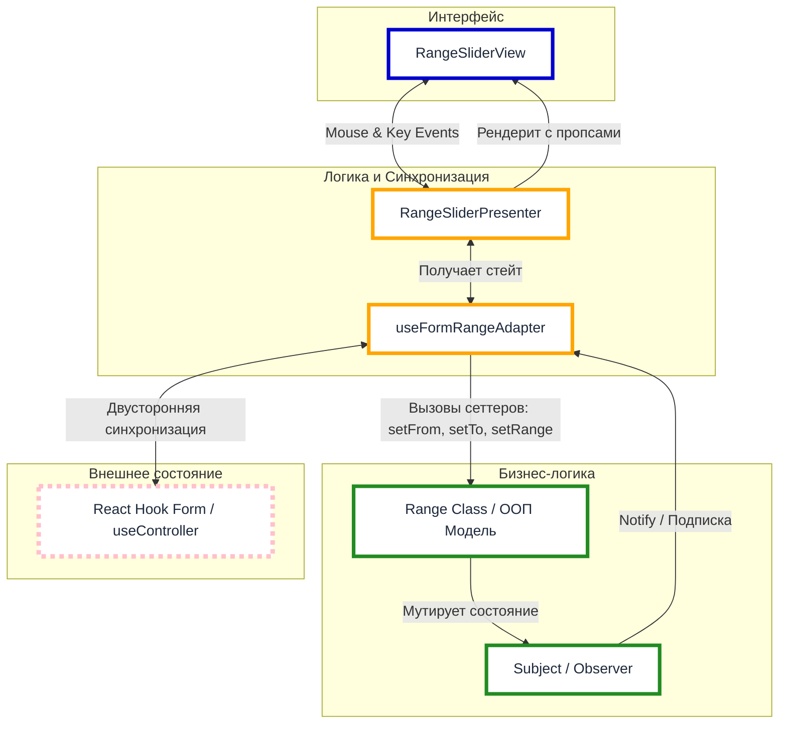
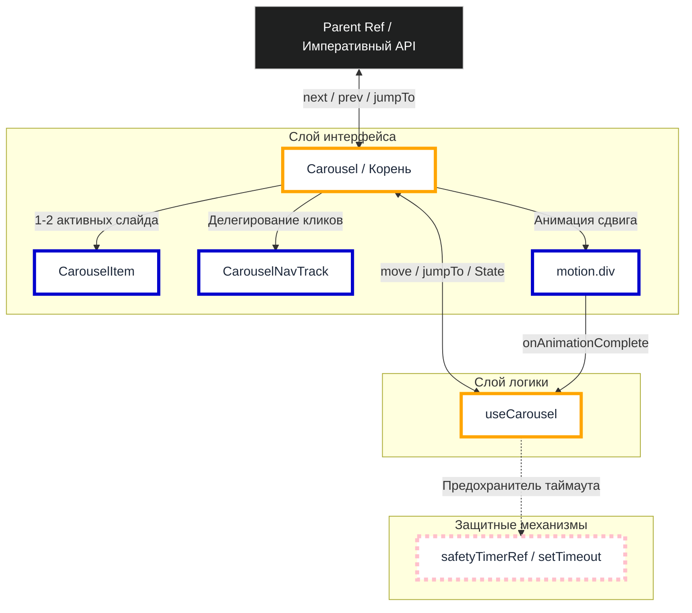
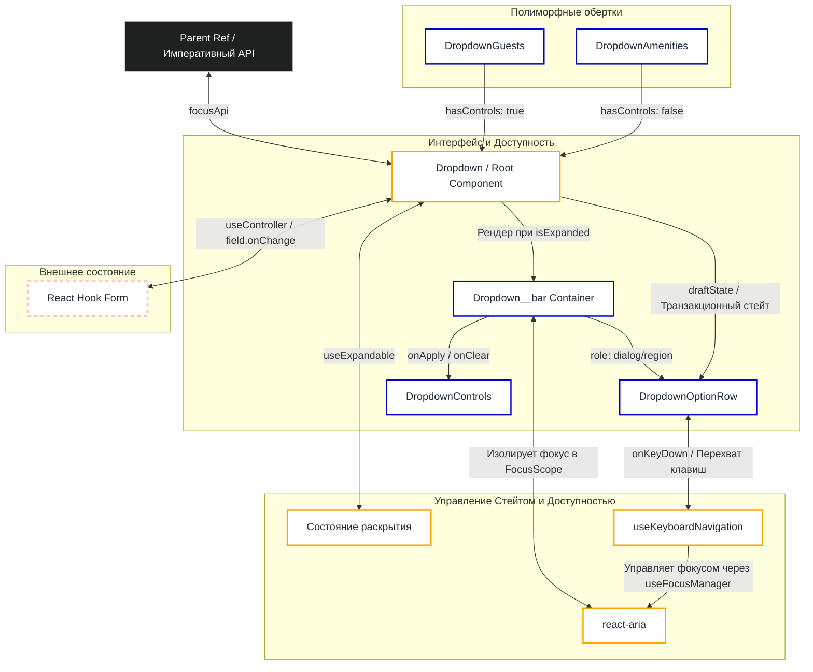
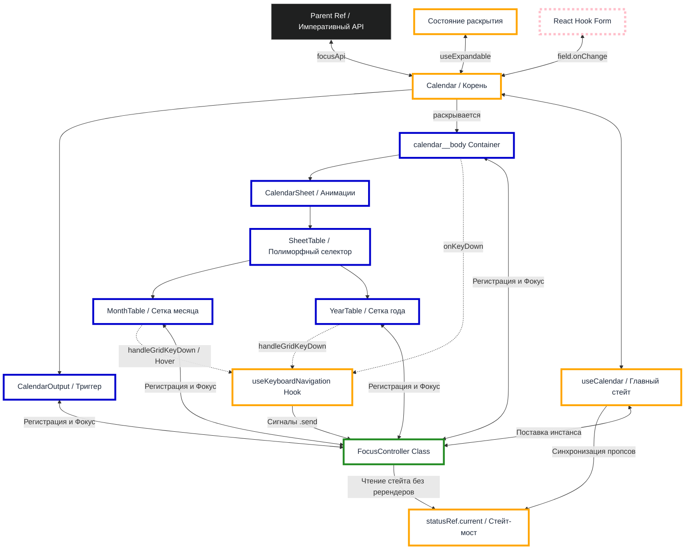

# Toxin Hotel Booking Platform (Frontend)

Фронтенд-приложение платформы бронирования отелей Toxin, разработанное на React и TypeScript. В основе проекта лежит кастомный UI-Kit, реализованный по методологии БЭМ без использования сторонних библиотек компонентов.

🌐 **[Демо-стенд приложения](https://toxin-site-frontend.onrender.com)**

---

## Технологический стек

* **Framework:** React 19
* **Build Tool:** Vite 8
* **Language:** TypeScript 6
* **State Management:** Redux Toolkit
* **Routing:** React Router 7
* **Styles:** Sass
* **Forms & Validation:** React Hook Form & Yup
* **Accessibility:** React Aria
* **Animation:** Framer Motion
* **Testing:** Vitest & React Testing Library
* **Linter & Formatter:** ESLint 9 & Prettier 3

---

## Инструкция по развертыванию

### Клонирование репозитория и установка зависимостей

```bash
git clone https://github.com/voxman90/toxin-site-frontend
cd toxin-site-frontend
npm install --legacy-peer-deps
```

## Скрипты и команды

| Команда | Описание |
| :--- | :--- |
| `npm run dev` | Запуск приложения в режиме локальной разработки. |
| `npm run test` | Одиночный запуск всех unit-тестов через `vitest`. |
| `npm run test:watch` | Запуск тестов в режиме отслеживания изменений. |
| `npm run lint` | Проверка кода линтером ESLint. |
| `npm run lint:fix` | Автоматическое исправление ошибок линтера. |
| `npm run format` | Принудительное форматирование файлов через Prettier. |

---

## Архитектура и качество кода

### 1. Общий подход

Фронтенд-приложение изолировано от бэкенда и базируется на стеке React, TypeScript, Redux Toolkit и Sass. 

Архитектурно проект разделен на две части:
* **Страницы бизнес-логики** — лендинг, формы авторизации, страницы расширенного поиска и бронирования номеров.
* **Изолированная песочница** — автономное окружение (UI-Kit) для ручного тестирования дизайн-системы, шрифтов, глобальных компонентов и интерактивных элементов форм.

### 2. Контроль качества

Надежность приложения поддерживается комплексным подходом:
* **Статическая типизация:** TypeScript минимизирует ошибки на этапе написания кода.
* **Линтинг и форматирование:** Инструменты ESLint и Prettier принудительно поддерживают единый стиль.
* **Валидация данных:** Формы валидируются на стороне клиента с помощью схем Yup.
* **Тестирование:** Логика компонентов и утилиты покрыты unit-тестами в Vitest и с использованием React Testing Library.
* **Контрактная безопасность:** Типы данных API автоматически синхронизируются с бэкендом через GitHub Actions на основе спецификации OpenAPI.

### 3. Синхронизация контракта

Разработка ведется по принципу Code-First (Schema-Driven подход). Фронтенд не описывает модели данных вручную, а использует готовые типы, автоматически поставляемые из бэкенд-репозитория.

Процесс автоматизации устроен следующим образом:
1. Бэкенд формирует спецификацию API `openapi.json` на основе Zod-схем и описания эндпоинтов в роутах.
2. Пайплайн GitHub Actions компилирует чистые типы TypeScript с помощью утилиты `openapi-typescript` на основе этого контракта.
3. Сгенерированный файл `api.ts` автоматически поставляется в репозиторий фронтенда (обновление происходит только при наличии изменений в контракте).

Внутри фронтенд-приложения типы извлекаются из файла `api.ts` и используются для типизации Yup-схем, маршрутов, а также ключевых сущностей платформы (комнаты, пользователи, отзывы, правила, сервисы).

### 4. Тестирование

Для написания тестов используется фреймворк **Vitest**. Настройка тестовых сред разделена под конкретные задачи:
* По умолчанию настроена среда `node`.
* Для тестирования взаимодействия с пользователем через `user-event` применяется `jsdom`.
* Для легковесной симуляции браузерного окружения задействован `happy-dom`.

В процессе тестирования применяется стандартный арсенал для изоляции логики и ускорения асинхронных операций: моки, шпионы, стабы и подложные таймеры.

При проверке компонентов поиск элементов осуществляется через `screen` (если это целесообразно), что дополнительно проверяет доступность интерфейса.

### 5. Принципы разработки

При написании кода используются принципы DRY, SOLID и YAGNI, а для тестов — преимущественно — DAMP.

Основные критерии качества:
* **Читаемость:** Самодокументируемый код без избыточных комментариев.
* **Изоляция слоев:** Возведение барьеров абстракции между компонентами (включая использование паттерна MVP).
* **Тестируемость:** Использование чистых функций, иммутабельности и идемпотентности.

### 6. Управления состоянием

Глобальное состояние вынесено в слайсы Redux Toolkit, а сетевые запросы инкапсулированы в асинхронные экшены (thunks). Для хранения параметров поиска URL-строка используется как единый источник правды (SSOT). 

### 7. Аутентификация

Аутентификация построена на базе токенов JWT. Полученный токен сохраняется в `localStorage` и автоматически прикрепляется к каждому сетевому запросу в заголовке `Authorization` через интерцептор Axios.

### 8. Доступность

Интерфейс опирается на семантическую разметку и управляется с клавиатуры. Кастомные элементы управления — дропдауны, календарь, range-слайдер, карусель и пагинация — снабжены необходимыми ARIA-атрибутами.

Для контроля фокуса используется библиотека `@react-aria`. С её помощью реализованы ловушки фокуса (focus trap), а также кастомное поведение фокуса для интерактивного дропдауна с транзакционным состоянием.

Нативное поведение фокуса приоритетно (во избежание рассинхронизации с состоянием React). Однако из-за отсутствия в веб-спецификациях флага для программного вызова `focus-visible` применяются обходные решения.

### 9. Обработка ошибок

Страницы обернуты в ErrorBoundary для предотвращения падения всего приложения. 

Большинство ошибок локализуется внутри компонент. В зависимости от характера сбоя выводится заглушка или диалоговое окно с предложением повторить запрос или вернуться на главную страницу. Для некритичных событий (например, сбой при установке лайка) используются всплывающие уведомления react-toastify.

На уровне форм ошибки отлавливаются схемами валидации yup. Эти же схемы блокируют отправку некорректных запросов к бэкенду, в том числе при инициализации состояния формы напрямую из параметров URL.

### 10. Стилизация и адаптивность

Архитектура стилей построена по методологии БЭМ. Для управления специфичностью и изоляции глобального контекста используются слои CSS (`@layer`: `reset`, `utilities`), а переиспользуемые параметры вынесены в CSS-переменные.

Адаптивность интерфейса реализуется через медиа-запросы (`@media`), относительные единицы измерения, функцию `clamp()` и т.д. Построение сеток и выравнивание элементов завязано на современные механизмы раскладки (Grid, Flexbox, `flow-root`).

Препроцессор SCSS применяется исключительно в качестве надстройки для задач, которые пока не решаются нативным CSS или не имеют широкой поддержки в браузерах. С его помощью реализованы миксины для управления типографикой и динамической подстановки шрифтов, а также плейсхолдеры (`%shimmer`, `%disabled`) для переиспользования анимаций скелетонов и состояний элементов интерфейса.

### 11. Интернационализация

Интерфейс поддерживает две локали — русскую и английскую. Интернационализация реализована на базе i18next с разделением переводов по пространствам имен (components, pages, ui-kit). Локализация затрагивает текстовый контент, содержимое ARIA-атрибутов, а также статические и динамические строки с использованием встроенных механизмов плюрализации и интерполяции.

Ключи переводов строго типизированы, что исключает использование невалидных ключей на этапе компиляции.

Для динамического форматирования относительного времени используется библиотека date-fns.

### 12. Оптимизация производительности

Разработка ведется по принципу «никакой преждевременной оптимизации». Мемоизация React-компонентов (`memo`, `useMemo`, `useCallback`) применяется взвешенно, наряду с сохранением стабильных ссылок, уплощением объектов в массивах зависимостей и вынесением логики в подкомпоненты.

В проекте используются легковесные и быстрые альтернативы: `happy-dom` вместо `jsdom` в части тестовых сред, `clsx` вместо `classnames` для работы с классами, и `tsx` вместо `ts-node` для скриптов.

Для эффективного tree shaking применяются избирательные импорты библиотек. Предотвращение утечек памяти реализуется через отмену асинхронных операций с помощью AbortController и удаление слушателей событий при размонтировании компонентов. На уровне сборки настроено чанкование кода.

### 13. Проектирование интерфейса (UX)

Для предотвращения визуального шума и мерцания интерфейса во время загрузки данных сетка страниц замещается компонентами-скелетонами. Для мгновенных ответов API на клиенте предусмотрена искусственная задержка, исключающая кратковременное мигание индикаторов загрузки. Процесс обработки запросов визуализируется через скелетоны или размытие (blur) в зависимости от контекста, давая пользователю явную обратную связь о работе интерфейса, даже если результирующие данные не изменились.

Интенсивный пользовательский ввод защищен дебаунсом (например, при перемещении ползунка цен с клавиатуры или мыши). Быстрые повторные клики по элементам фильтрации не приводят к мерцанию карточек номеров, так как промежуточные сетевые запросы принудительно отменяются через AbortController. Формы подсвечивают невалидные поля, переводят на них фокус и выводят сообщения об ошибках.

Параметры поиска и пагинации синхронизированы с URL-строкой, позволяя использовать навигацию «Назад/Вперед», обновлять страницу и передавать ссылку без потери состояния фильтров.

## 3. Ключевые компоненты

### 1 Range-slider

#### Описание

Рендж-слайдер с двумя ползунками для задания диапазона значений. Реализован в соответствии с паттерном MVP (Model-View-Presenter): бизнес-логика и математика расчетов инкапсулированы в изолированном классе, а синхронизация с состоянием форм React выполняется через кастомный хук-адаптер.

#### Схема



#### Пропсы

| Свойство | Тип | Обязательный | По умолчанию | Описание |
| :--- | :--- | :---: | :---: | :--- |
| `nameFrom` | `Path<T>` | **Да** | — | Имя поля формы для нижнего значения интервала (`from`). |
| `nameTo` | `Path<T>` | **Да** | — | Имя поля формы для верхнего значения интервала (`to`). |
| `control` | `Control<T>` | **Да** | — | Объект `control` из инстанса `react-hook-form`. |
| `config` | `Partial<RangeState>` | Нет | — | Конфигурация для инициализации модели. |
| `orientation` | `'horizontal' \| 'vertical'` | Нет | `'horizontal'` | Визуальная ориентация слайдера. |
| `isRangeDraggable`| `boolean` | Нет | `false` | Разрешает перетаскивание интервала за трек. |
| `disabled` | `boolean` | Нет | `false` | Блокирует события мыши и навигацию с клавиатуры. |
| `onMouseDown` | `(end: Ends \| 'range') => void` | Нет | — | Колбэк при нажатии мыши на ползунок или трек. |
| `onKeyDown` | `(e: KeyEvent, end: Ends \| 'range') => void` | Нет | — | Колбэк при нажатии клавиши на активном элементе. |
| `onKeyUp` | `(e: KeyEvent, end: Ends \| 'range') => void` | Нет | — | Колбэк при отпускании клавиши на активном элементе. |

### 2 Карусель

#### Описание

Компонент реализует циклическую карусель на базе анимаций framer-motion, с возможностью императивного контроля.

Рендеринг: Компонент не рендерит все слайды одновременно. На основе флагов состояния в DOM монтируются строго 1, либо 2 элемента (текущий статичный слайд, уходящий slidingFrom и приходящий slidingTo).

Логика состояний: Кастомный хук инкапсулирует стейт-машину сдвигов. Завершение анимации финализируется на уровне микротасок. Случай зависания анимации обрабатывается с помощью таймера (safetyTimerRef), принудительно завершающего фазу анимации по истечении таймаута.

Циклический расчет: Математический хелпер рассчитывает кратчайшую траекторию движения при прыжках через несколько слайдов на основе остатка от деления.

Динамический трек навигации: Реализует паттерн скользящего окна. Если количество слайдов превышает 5, трек смещается по горизонтали, а крайние видимые точки сжимаются в размерах, визуально имитируя бесконечную ленту. Для оптимизации кликов используется делегирование событий на общем контейнере трека.

#### Схема



#### Пропсы

| Свойство | Тип | Обязательный | По умолчанию | Описание |
| :--- | :--- | :---: | :---: | :--- |
| `children` | `CarouselChildren` | **Да** | — | Дети, строго `CarouselItem`. |
| `activeItemIndex`| `number` | Нет | `0` | Индекс активного слайда при инициализации. |
| `hasControlButtons`| `boolean` | Нет | `false` | Флаг отображения боковых кнопок Prev/Next. |
| `hasNavPanel` | `boolean` | Нет | `false` | Флаг отображения навигационной панели. |
| `isFocusable` | `boolean` | Нет | `false` | Включает фокус на боковых кнопках. |
| `transition` | `Transition` | Нет | `duration: 0.4` | Конфигурация кривой и длительности анимации для `framer-motion`. |
| `onAnimationEnd` | `(index: number) => void` | Нет | `NOOP` | Колбэк, вызываемый по завершении сдвига слайдов. |

#### Императивный интерфейс

Передаётся через ref родительскому компоненту:

| Метод | Сигнатура | Описание |
| :--- | :--- | :--- |
| `next` | `() => void` | Переключить на следующий слайд. |
| `prev` | `() => void` | Переключить на предыдущий слайд. |
| `jumpTo` | `(to: number) => void` | Перейти на указанный слайд. |
| `getElement` | `() => HTMLDivElement \| null` | Возвращает ссылку на корневой DOM-контейнер карусели. |

### 3. Дропдаун

#### Описание

Компонент с выпадающим окном для выбора количественных параметров. Работает в режиме транзакционного (с контрольной панелью), либо реактивного состояния. Расширяется обертками (DropdownGuests, DropdownAmenities) через передачу конфигурации и колбэка getDisplayedValue, возвращающего отображаемое значение в триггере.

Транзакционное\реактивное состояние: Поведение компонента регулируется флагом hasControls. При его активации изменения временно изолируются в локальном черновике. Клик на кнопку "Применить" синхронизирует черновик с react-hook-form. Кнопка "Очистить" сбрасывает данные кально.

При отсутствии контрольной панели значения обновляются реактивно, при каждом нажатии на кнопки опций.

Управление фокусом: Для интеграции с RHF передаёт через ref focusApi. Для программного фокуса обеспечивается обводка. В транзакционном режиме включает ловушку фокуса для модального окна, а для реактивного - обеспечивает его скрытие при табуляции вне.

Чтобы фокус не застревал при деактивации кнопок опций (например, при достижении максимума диапазона), фокус принудительно переносится на соседний интерактивный элемент.

#### Схема



#### Пропсы

| Свойство | Тип | Обязательный | По умолчанию | Описание |
| :--- | :--- | :---: | :---: | :--- |
| `name` | `Path<T>` | **Да** | — | Имя поля формы для объекта опций. |
| `control` | `Control<T>` | **Да** | — | Объект `control` из инстанса `react-hook-form`. |
| `options` | `DropdownOption[]` | **Да** | — | Массив конфигураций опций (имя, описание, диапазон min/max). |
| `getDisplayedValue`| `(state: DropdownValues) => string` | **Да** | — | Функция для вычисления и локализации итоговой строки триггера. |
| `labelText` | `string` | Нет | `''` | Текст заголовка компонента. |
| `labelAppendix` | `string` | Нет | `''` | Дополнительный текст (аппендикс) заголовка (отображается справа от основного текста). |
| `isExpanded` | `boolean` | Нет | `false` | Начальное состояние раскрытия списка при монтировании. |
| `isExpandingDisabled`| `boolean` | Нет | `false` | Флаг блокирующий раскрытие\скрытие выпадающего списка. |
| `hasControls` | `boolean` | Нет | `false` | Включает режим черновика (транзакционного стейта) и рендерит кнопки Применить/Очистить. |
| `size` | `'md' \| 'lg'` | Нет | `'lg'` | Управляет фиксированной шириной компонента. |
| `ref` | `RefObject<DropdownRef \| null>` | Нет | — | Реф для императивного вызова метода `focus()` (например, при ошибках валидации). |

### 4. Календарь

#### Описание

Календарь с бесконечной горизонтальной прокруткой листов, зумом (переключения режима месяц/год) и строгим управлением клавиатурным фокусом.

Управление состоянием: До момента нажатия кнопки "Применить" выбранные даты изолируются в буфере trace, не затрагивая форму. При закрытии календаря состояние синхронизируется обратно. Через useEffect развернут таймер-планировщик, который каждую полночь автоматически обновляет today и аннулирует просроченные даты прямо в открытом интерфейсе.

Смена листов и режима месяц\год: Календарь поддерживает два формата отображения: месяц и год. Переключение между ними (зум) анимировано через framer-motion. Смена листов календаря осуществляется через компонент Carousel.

Работа с фокусом: Фокус управляется через класс-контроллер, представляющий из себя конечный автомат с императивным управлением. Он синхронизирует фокус в DOM со стейтом через реф-геттер () => statusRef.current, исключая лишние ререндеры. Контроллер обрабатывает очередь отложенного фокуса для асинхронных анимаций карусели, возвращает фокус на триггер и т.д.

Навигация по ячейкам календаря осуществляется с помощью паттерна roving index. Фокус удерживается в модальном окне (focus trap).

#### Схема



#### Пропсы

| Свойство | Тип | Обязательный | По умолчанию | Описание |
| :--- | :--- | :---: | :---: | :--- |
| `nameFrom` | `Path<T>` | **Да** | — | Имя поля формы для даты прибытия (`from`). |
| `nameTo` | `Path<T>` | **Да** | — | Имя поля формы для даты отбытия (`to`). |
| `control` | `Control<T>` | **Да** | — | Объект `control` из инстанса `react-hook-form`. |
| `outputFormat` | `'range' \| 'separate' \| 'hidden'` | **Да** | — | Формат рендеринга инпутов шапки. |
| `sheetFormat` | `'month' \| 'year'` | Нет | `'month'` | Режим сетки при открытии. |
| `isExpanded` | `boolean` | Нет | `false` | Начальное состояние раскрытия календаря при монтировании. |
| `label` | `string` | Нет* | `''` | Заголовок поля. Обязателен только при `outputFormat: 'range'`. |
| `labelFrom` | `string` | Нет* | `''` | Заголовок даты заезда. Обязателен только при `outputFormat: 'separate'`. |
| `labelTo` | `string` | Нет* | `''` | Заголовок даты выезда. Обязателен только при `outputFormat: 'separate'`. |
| `ref` | `RefObject<CalendarRef \| null>` | Нет | — | Внешний императивный реф для фокуса полей. |

#### Императивный интерфейс

| Путь метода | Сигнатура | Описание |
| :--- | :--- | :--- |
| `from.focus` | `() => void` | Программный фокус инпута прибытия. |
| `to.focus` | `() => void` | Программный фокус инпута отбытия. |
